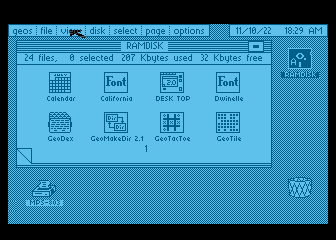
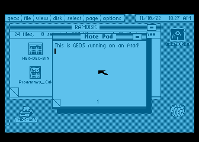
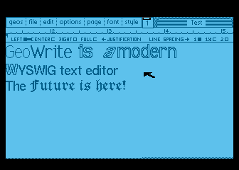

# GEOS Atari port

GEOS 2.0 by Berkeley Softworks

This is a fork of [GEOS 2.0 for C64/128 reverse-engineered](https://github.com/mist64/geos) by *Maciej Witkowiak*, *Michael Steil*

GEOS 2.0 was ported to 8-bit Atari by *Maciej Witkowiak*





## What is GEOS?

Please read main README.md for that.

## Atari port requirements

An 8-bit Atari computer with at least 128K of RAM: 130XE or expanded 65XE as a minimum.

There is only RAM disk available at the moment. I don't know how to handle communication with disk drives over SIO.
Please help if you can!

Right now expanded memory above 320K is not used. Except the very first bank, whole extra memory is meant to be used by RAM disk.

Unlike Apple 2 version, this port is *binary compatible with well-behaved GEOS software released for C64/128*.

Unfortunately most of BSW's own big software for GEOS 64 makes assumptions about the system that cause (in best scenario) visual glitches.
Many of these issues were later corrected for GEOS 128 due to 80-column mode support, but this port doesn't try to be compatible with GEOS128.

## Quickstart

Download one of the XEX files from the Releases section. Such file contains RAM disk image, GEOS Kernal, disk driver, input driver and loader for the whole thing.

Run an emulator and make sure to choose PAL system with at least 128K/320K of RAM. Setup joystick in port 1. Load the XEX file into emulator.

GEOS will boot into DeskTop in just few seconds.

Use OPTION key in place of C= for keyboard shortcuts.

## Atari port remarks

### Compatibility

This port has no reference implementation so I felt free to remove conditional C64/C128/Wheels/Gateway
code whenever I touched the files.

Order of segments is also rearranged to make the best use of available memory segments.

Well-beaved applications that run on both GEOS 64 and GEOS 128 (in 80-column mode) should also run on Atari.

BSW's own applications are not that well behaved. They write to VIC registers directly and use [custom screen recovery](https://www.pagetable.com/?p=1428) to save some RAM, but that recovery routine works on bitmap in VIC format.

You will have better luck trying out random GEOS software from 3rd party developers rather than running BSW flagship products. It shouldn't be too hard to patch some of the big applications (GeoPaint, GeoWrite and friends) to make them work in a reasonable way.

Compatibility problems come from:

- hardware differences (Atari Players vs VIC sprites, POKEY vs SID)
- memory map changes (hires bitmap screen with different organization for ANTIC than for VIC)
- missing capatibilities (24-pixel wide sprites, color matrix for hires mode)

Programs will not work correctly if:

- they use sprites or change their colors (e.g. Preferences Manager)
- they change color matrix in 40-column mode (e.g. DESK TOP)
- they require REU
- they access bitmap screen in 40-column mode directly (e.g. Maverick)
- they have custom recovery routine (e.g. GeoWrite)
- they write directly to I/O registers (e.g printer drivers)

They may not work at all or show some graphical glitches. For example, if an application tries to add some color it will write to `COLOR_MATRIX` space, which is now occupied by Player0/1/2/3 data, so mouse pointer will be temporarily overwritten.

| BSW Application | Remarks |
|-------------|---------|
| GeoPaint | too many visual glitches to be usable |
| GeoFont | too many visual glitches to be usable |
| IconEditor | too many visual glitches to be usable |
| GeoPublish | not as bad as GeoPaint, but still not usable |
| GeoCalc | crashes because it needs CBM BASIC for floating-point calculations |
| GeoWrite | patched to Atari works ok-ish if you type slowly |
| GeoFile | minimal visual glitches |
| GeoChart | works fine except area-fill chart |
| GeoDex | works fine |

Just like on C64 the processes (sleep and multitasking) are clocked by video frame rate.

### Performance

Atari port is probably somewhat faster than C64/128. Atari has higher CPU clock rate and linear screen organization that is easier to handle than VIC bitmap.
All the rectangle functions (*Rectangle*, *InvertRectangle*, *ImprintRectangle*, *RecoverRectangle*) have been optimized to reuse calculated screen coordinates.

Keyboard has its own interrupt and doesn't have to be scanned for every row/column.

### System startup

The boot code jumps right into DeskTop, but eventually it should at least try to run Auto-Exec applications from RAM disk.
In order to do it, that startup code has to be moved into higher memory area (out of current $2000 to $5000-$5FFF space).

## Players (sprites)

Player 0 is reserved for mouse pointer. Player 1 is reserved for text prompt, it will support fonts of any size.

Players 2 and 3 can be used by applications. The *DrawSprite* function takes VIC sprite format as an input.
It will take every third byte to show only the leftmost 8-pixels. The sprite will appear stretched in X direction because unlike ANTIC/GTIA the VIC sprites can have hires pixels.

You can see how it works in DeskTop if you select a file and then try to drag it to the border area (under disk window).

Missiles/Player5 are not used.

### Input devices

#### Pointer

A very simple joystick driver controls the mouse pointer. This driver doesn't support acceleration (but it should!). I couldn't get the original joystick driver to work.

Joystick driver can be changed during runtime, but the code has to be ported - you can't use any joystick drivers from GEOS64/128.

#### Keyboard

Mapping of special keys:

| Atari key | function |
|-----------|----------|
| BREAK     | unused |
| INV       | unused |
| OPTION    | C= (for keyboard shortcuts) |
| CAPS      | RUN/STOP |
| ESC       | <- (left arrow) |
| SHIFT+Delete | Backspace |
| CTRL+1..8 | F1..F8 |
| CTRL+Clear | Home |
| CTRL+Return | LineFeed |
| Tab | Tab |
| Clear | Clear |
| Delete | Del |
| Help | (pound sign) |

Cursor arrows work Atari style (CTRL+arrow key).

Other console keys (START, SELECT) are not scanned and not used.

## Memory

There are severe memory constraints. GEOS on C64 uses all available memory (64K), under I/O space and otherwise.

Atari has less RAM available because it can't switch off I/O and allocates whole 1K of RAM for sprites (Players). I put sprites in the same space as C64's color matrix. This saves memory, but mouse pointer occasionally will get corrupted or disappear. You may also see junk appearing in Player1 area (text prompt).

| Pages | Description  |
|-------:|:--------------|
| $00  | used for Kernal and application virtual registers, but addresses used by C64/128 Kernal are not touched (about $80-$FF) |
| $02-$03 | not touched by loader, boot code nor GEOS Kernal itself |
| $04-$5F | free to be used by applications |
| $60-$7F | screen backbuffer, but I moved them to bank 0 of expanded RAM, so any native Atari GEOS application (or pathed DeskTop) can use it |
| $80-$8B | system variables |
| $8C-$8F | on C64/128 this is color matrix, on Atari this is reserved for Player0-3 graphics |
| $90-$9D | reserved for disk driver, this would be swapped with expanded RAM by *SetDevice* function |
| $9E-$9F | GEOS Kernal code and variables |
| $A0-$BF | front buffer for 320x200 hires screen, it is shifted by 56 bytes to match exactly the 4K boundary on 101st line and keep linear addressing |
| $C0-$CF | GEOS Kernal code |
| $D0-$D7 | I/O |
| $D8-$FE | GEOS Kernal code, except 16 byte buffers at $DC00-0F and $DD00-0F. Atari Kernal emulates CIA#1 TOD clock in that space and remaining area is a buffer in case a user program wants to use TOD clock from CIA#2, write directly to user port (parallel printer port) or alter keyboard/joystick ports |
| $FE-$FF | input driver (joystick) |

Extra memory banks:

| bank | area (when mapped in) | description |
|------|------|-------------|
| 0 | $4000-$4FFF | GEOS Kernal code (using jump table from $D800)
| 0 | $5000-$5FFF | is reserved for (future) SIO disk driver |
| 0 | $6000-$7FFF | screen back buffer, drawing routines with imprint/recover screen from this area, not from system RAM |
| 1 | $4000-$40FF | disk header and block allocation map (BAM) |
| 1 | $4100-$41ff | first directory block

all the remaining areas are free to be used by files

Unlike C128 there is no special handling for desk accessories - they will have swap file created on RAM disk, which will be only a little slower than copying memory to reserved space.

### Disk drives

There is only one disk device available: RAM drive.

The supposed disk driver for SIO devices may use hardware directly or via ROM code. There are functions *InitForIO* and *DoneForIO* that in GEOS64/128 prepare
the system for using ROM routines for I/O. GEOS doesn't touch memory in $0200-$03ff. Some of zero-page registers are used by the system, but they can be easily preserved.

The requirements for a disk driver are:

- it needs to read/write 256-byte sectors at a time
- sectors are addressed by 8-bit track and sector numbers
- if a device responds to an identifier (disk drive number) it should be possible to change that identifier (DESK TOP uses this feature to swap third drive with one of the first two, but it's purely UI issue, not a system requirement)
- track 0 doesn't exist
- DeskTop 64 only knows about 1541/71/81 drives. For simplicity disk driver may present itself as a 1541, but it must map sector (18,0) to directory header and sector (18,1) to first directory block even if *GetDirHead* and *Get1stDirEntry* functions handle that already. Present RAM drive does just that.

GEOS Kernal implements on top of that a Commodore DOS-like file system. Track number 0 is forbidden, so the largest possible disk/partition (see my [CIAIDE project](https://github.com/ytmytm/c64-ciaide)) may have
up to 255 tracks, 256 sectors each for a total of almost 16MB.

Current RAM drive implementation:

- uses expanded memory that starts in bank 1
- uses tracks with 128 sectors each
- DeskTop ignores track&sector information for disk directory so track 18 (directory) is mapped to track 1
- Limited to 256K (Atari 320K), can be quite easily updated to 1024K if reusing 1581 drive code for BAM (block allocation map)

### Printer drivers

There are none, they will have to be ported. See Disk Drive section for notes about ROM code use for SIO.

### Time and date

There is no CIA time-of-day (TOD) clock, timekeeping is done by counting vertical blank interrupts. During banked operations a short interrupt routine is called and some of these events may be lost.

TOD clock from CIA#1 is emulated by converting current time into BCD and storing into $DC08-$DC0A, where DeskTop reads it directly.

There is no support for an alarm clock. It's tied to CIA TOD clock hardware feature.
The system doesn't provide any function to set the alarm (it's done in hardware by a Desk Accessory) you can only choose if/how it should react to the alarm.
There is no POKEY replacement code for playing sound chimes.

There is no PAL/NTSC detection yet, the system is assumed to be PAL.

## Building the system

It's best to use Linux or WSL for that.

Install Python3 and cc65 suite and then:

- if you like, run Makefile from `cc65/apps` (this will build filesel.cvt - tiny application launcher for DeskTop replacement among others)
- put the CVT files that you want to have in the system into `ramdisk/cvt-128k/` or `ramdisk/cvt-320k`
- run top-level Makefile to assemble the system and link it into XEX file

By default Makefile will produce a file for a 128K system (130XE). For more, pass `SYSTEM=atari320` option:
```
make SYSTEM=atari320
```

The result is in `build/<atari system>/GEOS<atari system>.XEX` file, ready to be used with an emulator.

I am abusing GCC preprocessor to add conditionals to ld65 configuration files and expand environment variables inside one of the ca65 sources.
Perhaps this should be rewritten to use proper macro expansion language, like `m4`.

There is another program in `tools` directory, that analyses resulting `build/<atari system>/kernal/kernal.map` file from pass 1 and
uses optimizer to put GEOS Kernal code into all available gaps as neatly as possible, so that as much as possible remaining area stays
just under $FE80 (input driver) address.

